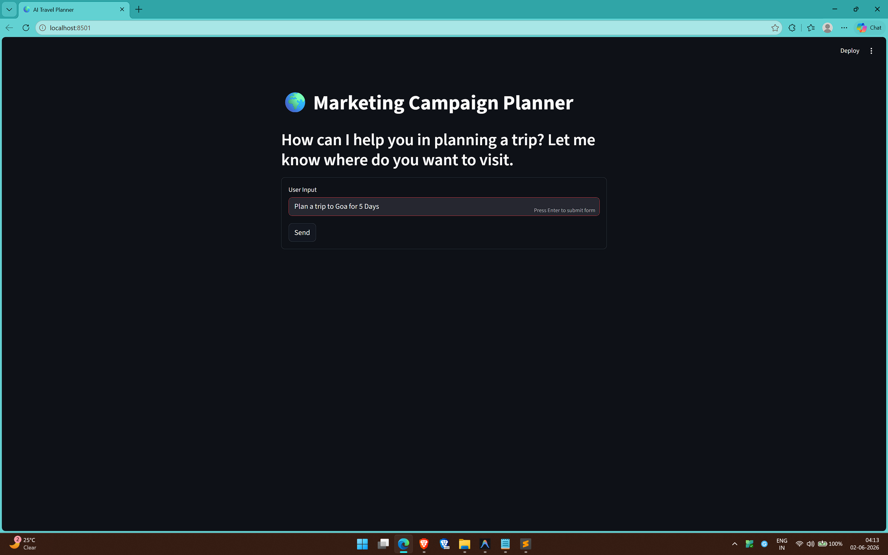
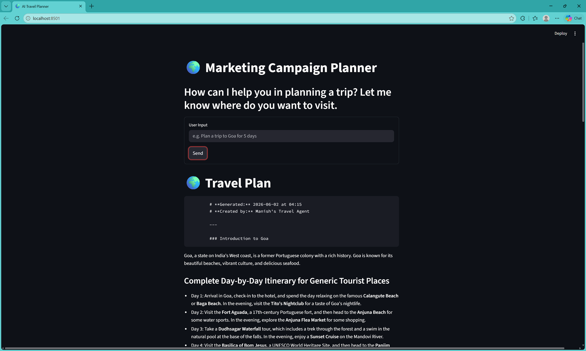
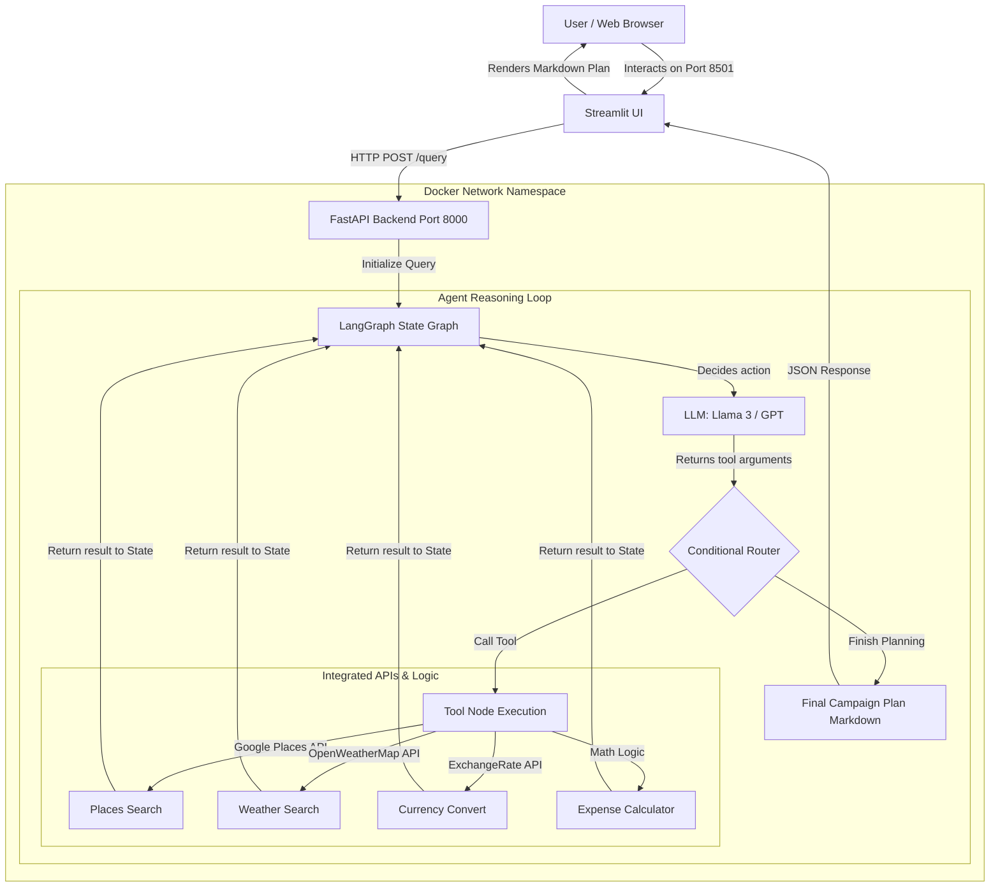
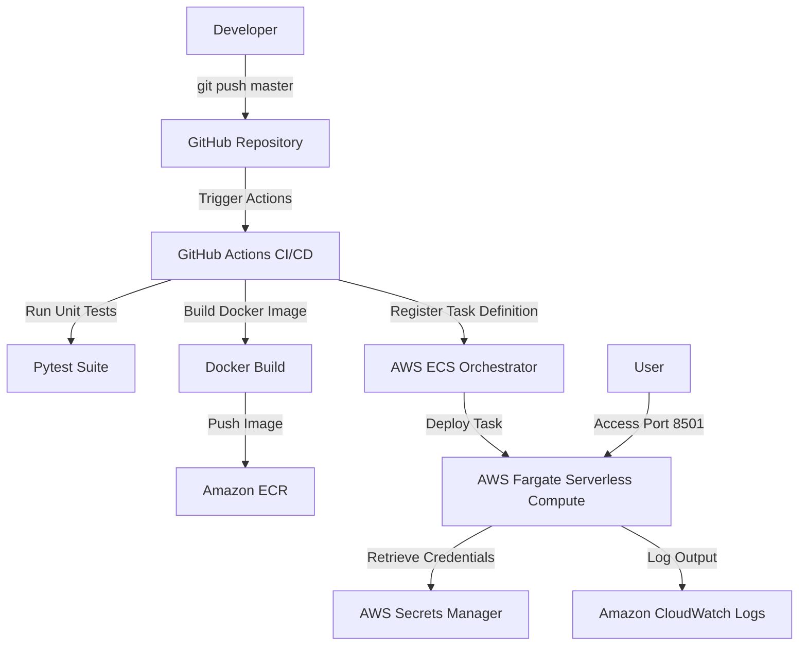

# Agentic AI Marketing Campaign Planner

[](https://ai-trip-planner-m20was.streamlit.app/)

An agentic AI Marketing Campaign Planner built with FastAPI, Streamlit, LangGraph, and Groq. This application runs a robust LangGraph state graph agent utilizing Llama-3.3-70B on Groq to plan detailed marketing and travel campaigns, complete with live weather details, places search, and custom currency/expense calculations.

**Live Deployment:** [https://ai-trip-planner-m20was.streamlit.app/](https://ai-trip-planner-m20was.streamlit.app/)


## Screenshots

| User Input (Streamlit Frontend) | AI Marketing Campaign Plan (Output) |
| :---: | :---: |
|  |  |

---

## Features

- **Agentic Workflow:** Powered by **LangGraph** for structured state management, tool execution, and cyclic agent reasoning.
- **FastAPI Backend:** Lightweight REST API that serves the compiled agent graph and handles real-time queries.
- **Streamlit Frontend:** An interactive, conversational web interface for seamless planning.
- **Groq Integration:** Blazing-fast inference using state-of-the-art open-source LLMs (like `Llama-3.3-70B-Versatile`).
- **Real-Time Tools:**
  - **Google Places API:** Resolves live local locations, eateries, and attractions.
  - **OpenWeatherMap API:** Retrieves real-time weather and temperature forecasts.
  - **Exchange Rate API:** Converts international travel and campaign budgets instantly.
  - **Expense Calculator:** Dynamically computes daily budgets and overall expenses.
  - **Tavily Web Search:** Fallback web searching when APIs reach limit thresholds.

---

## Setup and Installation

Follow these steps to set up and run the project locally.

### 1. Prerequisites
- **Python 3.10+** (Python 3.13 recommended)
- **uv** (Extremely fast Python package manager)

If you don't have `uv` installed, you can install it via pip:
```bash
pip install uv
```

### 2. Clone and Initialize Environment
Navigate to the project root directory and create the virtual environment using `uv`:
```bash
# Deactivate conda if active
conda deactivate

# Create a virtual environment named ".venv" using uv
uv venv .venv --python 3.13
```

### 3. Activate the Environment
Activate the created virtual environment:
*   **Windows (Command Prompt):**
    ```cmd
    .\.venv\Scripts\activate.bat
    ```
*   **Windows (PowerShell):**
    ```powershell
    .\.venv\Scripts\Activate.ps1
    ```
*   **macOS / Linux:**
    ```bash
    source .venv/bin/activate
    ```

### 4. Install Dependencies
Install and synchronize all project dependencies defined in `pyproject.toml`:
```bash
uv sync
```

### 5. Managing Dependencies
To add new libraries to the project (this will automatically install them and update your `pyproject.toml` file):
```bash
uv add <package-name>
```

To remove a library:
```bash
uv remove <package-name>
```

---

## Environment Configuration

Create a `.env` file in the project root directory and populate it with your API keys. You can use the template below:

```env
# LLM Provider Key (Groq is free and recommended)
GROQ_API_KEY="your_groq_api_key_here"
OPENAI_API_KEY="optional_openai_api_key_here"

# Location Services Key
GPLACES_API_KEY="your_google_maps_places_api_key_here"

# Weather Forecast Key
OPENWEATHERMAP_API_KEY="your_openweathermap_api_key_here"

# Currency Conversion Key
EXCHANGE_RATE_API_KEY="your_exchangerate_api_key_here"

# Search Fallback Key (Optional)
TAVILY_API_KEY="optional_tavily_search_api_key_here"

# LangSmith Agent Tracing & Debugging (Optional)
LANGCHAIN_TRACING_V2="true"
LANGCHAIN_API_KEY="optional_langchain_api_key_here"
LANGCHAIN_PROJECT="AI-Marketing-Campaign-Planner"
```

---

## How to Run the Project

Start both the **FastAPI backend** and the **Streamlit frontend** in separate terminal windows with your virtual environment (`.venv`) activated in both.

### 1. Start the Backend (FastAPI)
In the first terminal window, start the backend server:
```bash
uv run uvicorn main:app --reload
```
The backend server will run at `http://127.0.0.1:8000`.

### 2. Start the Frontend (Streamlit)
In the second terminal window, start the Streamlit web interface:
```bash
uv run streamlit run streamlit_app.py
```
This will automatically launch the frontend in your default browser at `http://localhost:8501`.

---

## How to Run Tests

This project uses `pytest` for unit and integration testing. To execute the tests, run:

```bash
# Run all tests
uv run pytest -v

# Run only the unit tests
uv run pytest tests/unit/ -v
```

---

## CI/CD & AWS ECS Fargate Deployment (LLMOps)

This application is configured for production-grade cloud deployment using a serverless container architecture on AWS.

### Application Architecture

This diagram shows how the Streamlit frontend, FastAPI backend, and LangGraph agent workflow communicate internally:



### Cloud Deployment Architecture



### Deployment Details

*   **Containerization (`Dockerfile` & `entrypoint.sh`)**: The application frontend (Streamlit) and backend (FastAPI) are containerized into a single multi-process Docker image launched via a custom entrypoint script.
*   **Orchestration & Compute (`AWS ECS on Fargate`)**: Containers are deployed serverlessly. AWS manages the scaling and underlying VM infrastructure, eliminating manual host management.
*   **Secure Credential Management (`AWS Secrets Manager`)**: All API keys (Groq, OpenAI, Google Places, OpenWeatherMap, etc.) are stored in AWS Secrets Manager and resolved dynamically at runtime using IAM Roles, ensuring no credentials are ever checked into Git.
*   **Observability (`Amazon CloudWatch`)**: App logs are automatically routed from the container to CloudWatch log groups for real-time tracking.
*   **Automation (`GitHub Actions`)**: Every push to `master` triggers a pipeline that:
    1. Runs the test suite via Pytest.
    2. Logins into Amazon ECR.
    3. Builds, tags, and pushes the Docker container.
    4. Registers the new ECS Task Definition and triggers a rolling service deployment.

