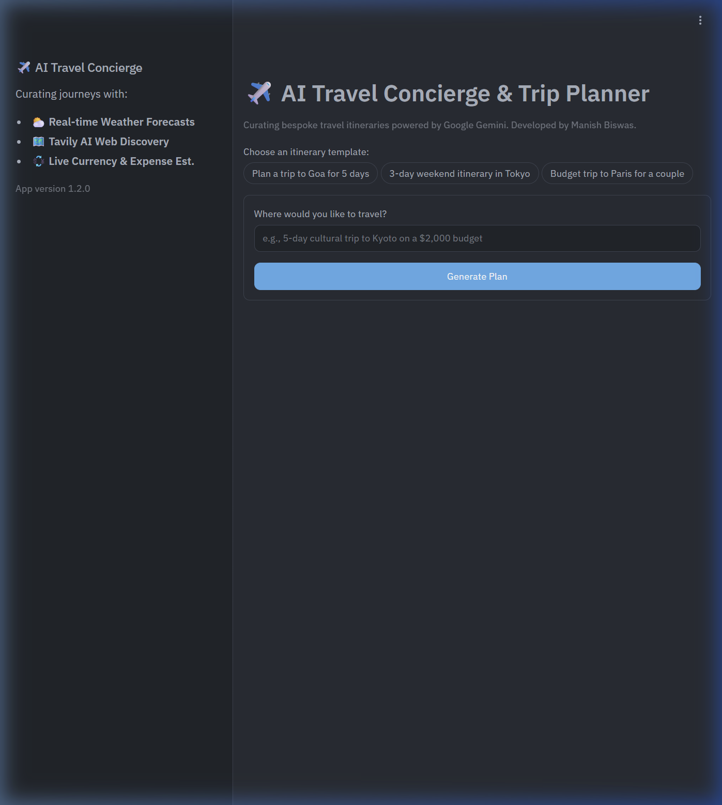
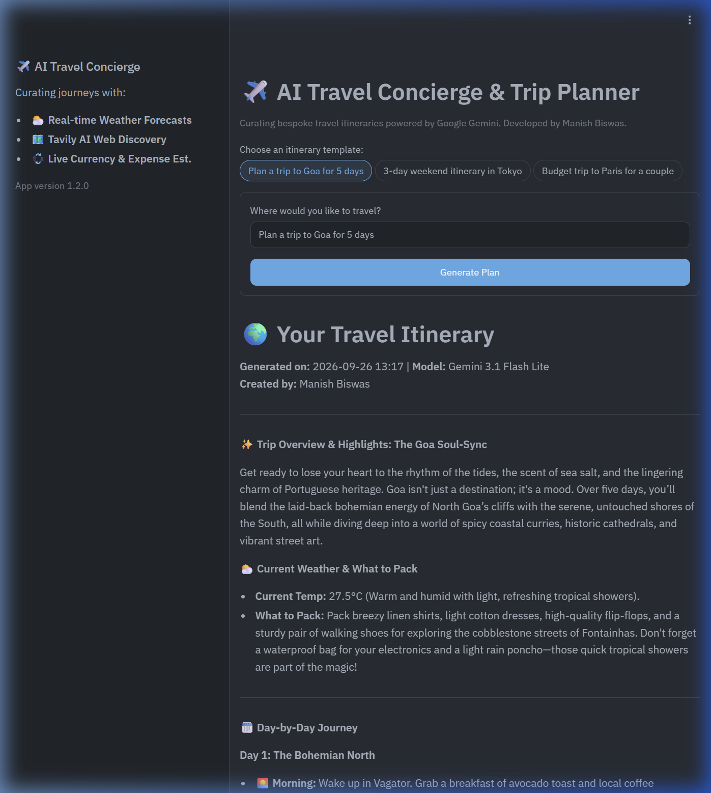
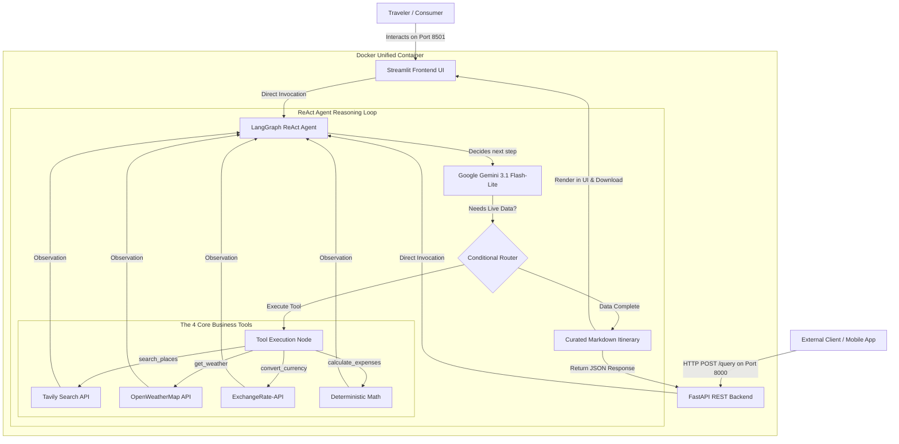
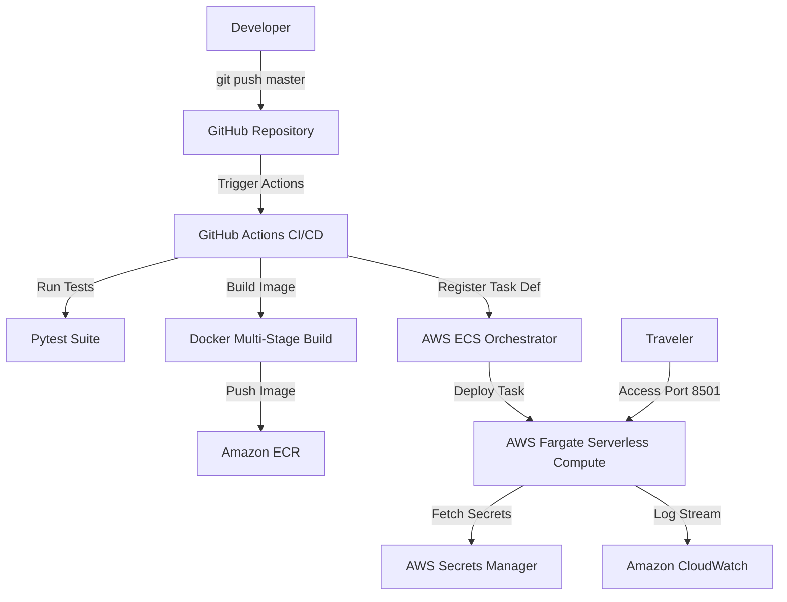

# ✈️ Agentic AI Travel Planner

[](https://ai-trip-planner-m20was.streamlit.app/)
[](https://www.python.org/)
[](https://langchain-ai.github.io/langgraph/)
[](https://ai.google.dev/)

An autonomous AI Travel Concierge built with **FastAPI**, **Streamlit**, and **LangGraph**, powered by **Google Gemini**. The agent dynamically researches real-time destination weather, discovers attractions and authentic eateries via **Tavily AI Search**, and calculates multi-currency trip budgets.

**Live Deployment:** [https://ai-trip-planner-m20was.streamlit.app/](https://ai-trip-planner-m20was.streamlit.app/)

---

## 📸 Screenshots & Interactive Demo

### Application Walkthrough


### Interface States
| User Input (Streamlit Frontend) | Curated Travel Itinerary (Output) |
| :---: | :---: |
|  |  |

---

## 🌟 Key Features

- **Autonomous Agentic Workflow:** Built with **LangGraph** for cyclic tool reasoning, state tracking, and adaptive decision-making.
- **Google Gemini Engine:** Uses `gemini-3.1-flash-lite` for lightning-fast (~1.3s) generation with high reliability on Google's free tier.
- **Real-Time 4-Tool Ecosystem:**
  - ⛅ **`get_weather` (OpenWeatherMap API):** Live forecasts, temperature, and tailored packing advice.
  - 🗺️ **`search_places` (Tavily AI Search):** Real-time web discovery for top sights, hidden gems, and restaurants.
  - 💱 **`convert_currency` (ExchangeRate-API):** Live foreign exchange conversions and international pricing.
  - 💰 **`calculate_expenses` (Math Engine):** Deterministic cost summation to prevent LLM math hallucinations.
- **Dual Interfaces:**
  - **Streamlit Web UI (Port 8501):** Intuitive consumer interface with one-click prompt templates and markdown export.
  - **FastAPI REST API (Port 8000):** Production-ready endpoints (`/` health check, `/query`) for omnichannel programmatic access.

---

## 🛠️ Architecture


```mermaid
graph TD
    User[Traveler / Consumer] -->|Interacts on Port 8501| Streamlit[Streamlit Frontend UI]
    Client[External Client / Mobile App] -->|HTTP POST /query on Port 8000| FastAPI[FastAPI REST Backend]
    
    subgraph Container [Docker Unified Container]
        Streamlit -->|Direct Invocation| Agent[LangGraph ReAct Agent]
        FastAPI -->|Direct Invocation| Agent
        
        subgraph AgentLoop [ReAct Agent Reasoning Loop]
            Agent -->|Decides next step| LLM[Google Gemini 3.1 Flash-Lite]
            LLM -->|Needs Live Data?| Router{Conditional Router}
            Router -->|Execute Tool| ToolNode[Tool Execution Node]
            
            subgraph Tools [The 4 Core Business Tools]
                ToolNode -->|search_places| T1[Tavily Search API]
                ToolNode -->|get_weather| T2[OpenWeatherMap API]
                ToolNode -->|convert_currency| T3[ExchangeRate-API]
                ToolNode -->|calculate_expenses| T4[Deterministic Math]
            end
            
            T1 -->|Observation| Agent
            T2 -->|Observation| Agent
            T3 -->|Observation| Agent
            T4 -->|Observation| Agent
            
            Router -->|Data Complete| EndState[Curated Markdown Itinerary]
        end
    end
    
    EndState -->|Render in UI & Download| Streamlit
    EndState -->|Return JSON Response| FastAPI
```

---

## 📁 Repository Structure

```
AI_Trip_Planner/
├── agent/
│   └── agentic_workflow.py    # LangGraph ReAct Agent (~25 lines)
├── tools/                     # The 4 Core Business Tools (~10 lines each)
│   ├── place_search_tool.py   # Tavily web discovery
│   ├── weather_info_tool.py   # OpenWeatherMap live forecasts
│   ├── currency_conversion_tool.py # ExchangeRate-API FX conversion
│   ├── expense_calculator_tool.py  # Deterministic expense calculator
│   └── __init__.py            # Consolidates get_tools()
├── utils/                     # Infrastructure helpers
│   ├── config_loader.py       # Reads config.yaml
│   └── model_loader.py        # Initializes Gemini LLM with retry policy
├── config/
│   └── config.yaml            # Model configuration
├── prompt_library/
│   └── prompt.py              # System prompt and formatting rules
├── notes/                     # 📚 Business Analyst documentation & interview guides
│   ├── agentic_workflow_notes.md
│   ├── tools_notes.md
│   ├── utils_notes.md
│   ├── docker_notes.md
│   ├── api_notes.md
│   ├── dependencies_notes.md
│   ├── streamlit_notes.md
│   └── aws_deployment_notes.md
├── tests/
│   └── unit/test_calculator.py# Automated pytest suite
├── streamlit_app.py           # Streamlit frontend UI
├── main.py                    # FastAPI backend REST API
├── entrypoint.sh              # Multi-process container startup
├── Dockerfile                 # Layer-cached container definition
├── pyproject.toml             # Modern PEP 621 packaging
└── requirements.txt           # Dependency lockfile
```

---

## 🚀 Setup and Installation

### 1. Prerequisites
- **Python 3.10+** (Python 3.13 recommended)
- **uv** package manager

If you don't have `uv` installed:
```bash
pip install uv
```

### 2. Activate Virtual Environment (copy activate.ps1 file contents to terminal)
Activate your existing workspace virtual environment:
* **Windows (PowerShell):**
  ```powershell
  .\activate.ps1
  ```
* **Windows (CMD):**
  ```cmd
  activate.bat
  ```
* **macOS / Linux:**
  ```bash
  source .venv/bin/activate
  ```

### 3. Install Dependencies
```bash
uv pip install -r requirements.txt
```

---

## 🔑 Environment Configuration

Create a `.env` file in the project root directory with your active API keys:

```env
# LLM Provider
GEMINI_API_KEY="your_google_gemini_api_key_here"

# Real-Time Search & Location Discovery
TAVILY_API_KEY="your_tavily_api_key_here"

# Weather Forecast
OPENWEATHERMAP_API_KEY="your_openweathermap_api_key_here"

# Currency Conversion
EXCHANGE_RATE_API_KEY="your_exchangerate_api_key_here"

# LangSmith Tracing & Observability (Optional)
LANGCHAIN_TRACING_V2="true"
LANGCHAIN_API_KEY="optional_langchain_api_key_here"
LANGCHAIN_PROJECT="AI-Trip-Planner"
```

---

## 🖥️ Running the Application

Start the **FastAPI backend** and **Streamlit frontend** in separate terminal windows with your virtual environment activated:

### 1. Start the Backend (FastAPI)
```bash
uvicorn main:app --reload
```
API runs at `http://127.0.0.1:8000` (Interactive docs at `http://127.0.0.1:8000/docs`).

### 2. Start the Frontend (Streamlit)
```bash
streamlit run streamlit_app.py
```
Launches the frontend at `http://localhost:8501`.

---

## 🧪 Running Tests

Execute the unit tests using `pytest`:

```bash
pytest -v
```

---

## ☁️ CI/CD & Cloud Deployment (AWS ECS Fargate)

This application is ready for serverless container deployment on AWS:


```mermaid
graph TD
    Developer -->|git push master| GitHub[GitHub Repository]
    GitHub -->|Trigger Actions| Pipeline[GitHub Actions CI/CD]
    Pipeline -->|Run Tests| Pytest[Pytest Suite]
    Pipeline -->|Build Image| Docker[Docker Multi-Stage Build]
    Docker -->|Push Image| ECR[Amazon ECR]
    Pipeline -->|Register Task Def| ECS[AWS ECS Orchestrator]
    ECS -->|Deploy Task| Fargate[AWS Fargate Serverless Compute]
    Fargate -->|Fetch Secrets| Secrets[AWS Secrets Manager]
    Fargate -->|Log Stream| CW[Amazon CloudWatch]
    User[Traveler] -->|Access Port 8501| Fargate
```

- **Containerization (`Dockerfile` & `entrypoint.sh`)**: Multi-process container running Streamlit and FastAPI.
- **Serverless Hosting (`AWS ECS on Fargate`)**: Auto-scaling infrastructure without managing EC2 instances.
- **Secret Management (`AWS Secrets Manager`)**: API keys injected dynamically at runtime via IAM roles.

### How to Access the Live Application on AWS ECS

Once the ECS Fargate task is in `RUNNING` status:

1. **Navigate to the Running Task:**
   - In the [AWS Console](https://console.aws.amazon.com/ecs/), go to **Amazon ECS** $\rightarrow$ **Clusters** $\rightarrow$ **`ai-planner-cluster`**.
   - Click the **Services** tab $\rightarrow$ select **`ai-planner-service`**.
   - Click the **Tasks** tab and select the active running task.

2. **Step 2: Copy the Public IP & Add `:8501`:**
   - On the task page, look under the **Networking** section for **Public IP**.
   - Copy the IP address (for example, if it is `16.176.147.145` or `13.236.80.218`).
   - Open a new tab in your web browser and enter:
     ```text
     http://<YOUR_PUBLIC_IP>:8501
     ```
     *(For example: `http://16.176.147.145:8501`)*

> [!NOTE]
> Make sure to type `http://` (not `https://`), followed by `:8501`.

### 📸 AWS Cloud Deployment Verification

| AWS ECS Fargate Task Configuration (`RUNNING`) | Live Application Deployed on AWS ECS |
| :---: | :---: |
|  |  |


