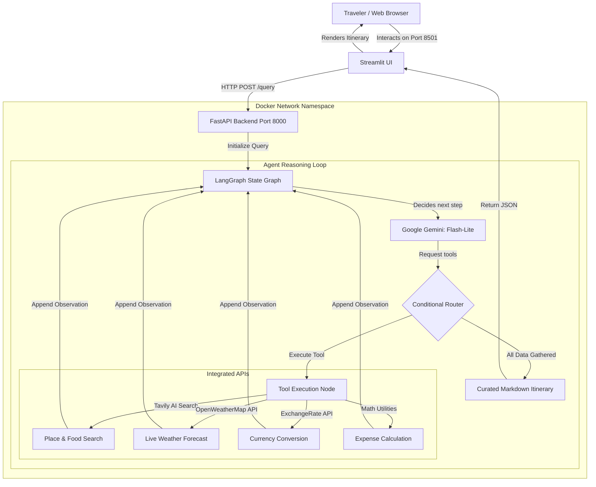
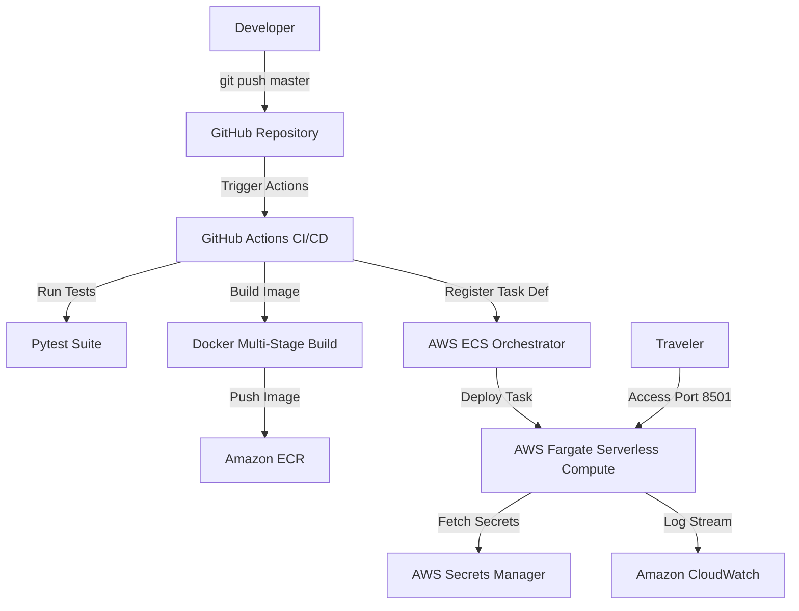

# ✈️ Agentic AI Travel Planner

[](https://ai-trip-planner-m20was.streamlit.app/)
[](https://www.python.org/)
[](https://langchain-ai.github.io/langgraph/)
[](https://ai.google.dev/)

An autonomous AI Travel Concierge built with **FastAPI**, **Streamlit**, and **LangGraph**, powered by **Google Gemini**. The agent dynamically researches real-time destination weather, discovers attractions and authentic eateries via **Tavily AI Search**, and calculates multi-currency trip budgets.

**Live Deployment:** [https://ai-trip-planner-m20was.streamlit.app/](https://ai-trip-planner-m20was.streamlit.app/)

---

## 📸 Screenshots & Interactive Demo

### Application Walkthrough


### Interface States
| User Input (Streamlit Frontend) | Curated Travel Itinerary (Output) |
| :---: | :---: |
|  |  |

---

## 🌟 Key Features

- **Autonomous Agentic Workflow:** Built with **LangGraph** for cyclic tool reasoning, state tracking, and adaptive decision-making.
- **Google Gemini Engine:** Uses `gemini-3.1-flash-lite` for lightning-fast (~1.3s) generation with high reliability on Google's free tier.
- **Real-Time Tool Ecosystem:**
  - ⛅ **OpenWeatherMap API:** Live forecasts, temperature, and tailored packing advice.
  - 🗺️ **Tavily AI Search:** Real-time web discovery for top sights, hidden gems, and restaurants.
  - 💱 **ExchangeRate-API:** Live currency conversions and international budgeting.
  - 💰 **Expense Calculator:** Automatic hotel costs, daily budgets, and trip totals.
- **Dual Interfaces:**
  - **Streamlit Web UI:** Intuitive, conversational interface with instant markdown download.
  - **FastAPI REST API:** Production-ready endpoint (`/query`) for headless programmatic access.

---

## 🛠️ Architecture


```mermaid
graph TD
    User[Traveler / Web Browser] -->|Interacts on Port 8501| Streamlit[Streamlit UI]
    Streamlit -->|HTTP POST /query| FastAPI[FastAPI Backend Port 8000]
    
    subgraph Container [Docker Network Namespace]
        FastAPI -->|Initialize Query| Graph[LangGraph State Graph]
        
        subgraph AgentLoop [Agent Reasoning Loop]
            Graph -->|Decides next step| LLM[Google Gemini: Flash-Lite]
            LLM -->|Request tools| Router{Conditional Router}
            Router -->|Execute Tool| ToolNode[Tool Execution Node]
            
            subgraph Tools [Integrated APIs]
                ToolNode -->|Tavily AI Search| T1[Place & Food Search]
                ToolNode -->|OpenWeatherMap API| T2[Live Weather Forecast]
                ToolNode -->|ExchangeRate API| T3[Currency Conversion]
                ToolNode -->|Math Utilities| T4[Expense Calculation]
            end
            
            T1 -->|Append Observation| Graph
            T2 -->|Append Observation| Graph
            T3 -->|Append Observation| Graph
            T4 -->|Append Observation| Graph
            
            Router -->|All Data Gathered| EndState[Curated Markdown Itinerary]
        end
    end
    
    EndState -->|Return JSON| Streamlit
    Streamlit -->|Renders Itinerary| User
```

---

## 🚀 Setup and Installation

### 1. Prerequisites
- **Python 3.10+** (Python 3.13 recommended)
- **uv** package manager

If you don't have `uv` installed:
```bash
pip install uv
```

### 2. Activate Virtual Environment
Activate your existing workspace virtual environment:
* **Windows (PowerShell):**
  ```powershell
  .\activate.ps1
  ```
* **Windows (CMD):**
  ```cmd
  activate.bat
  ```
* **macOS / Linux:**
  ```bash
  source .venv/bin/activate
  ```

### 3. Install Dependencies
```bash
uv pip install -r requirements.txt
```

---

## 🔑 Environment Configuration

Create a `.env` file in the project root directory with your active API keys:

```env
# LLM Provider
GEMINI_API_KEY="your_google_gemini_api_key_here"

# Real-Time Search & Location Discovery
TAVILY_API_KEY="your_tavily_api_key_here"

# Weather Forecast
OPENWEATHERMAP_API_KEY="your_openweathermap_api_key_here"

# Currency Conversion
EXCHANGE_RATE_API_KEY="your_exchangerate_api_key_here"

# LangSmith Tracing & Observability (Optional)
LANGCHAIN_TRACING_V2="true"
LANGCHAIN_API_KEY="optional_langchain_api_key_here"
LANGCHAIN_PROJECT="AI-Trip-Planner"
```

---

## 🖥️ Running the Application

Start the **FastAPI backend** and **Streamlit frontend** in separate terminal windows with your virtual environment activated:

### 1. Start the Backend (FastAPI)
```bash
uvicorn main:app --reload
```
API runs at `http://127.0.0.1:8000` (Interactive docs at `http://127.0.0.1:8000/docs`).

### 2. Start the Frontend (Streamlit)
```bash
streamlit run streamlit_app.py
```
Launches the frontend at `http://localhost:8501`.

---

## 🧪 Running Tests

Execute the unit tests using `pytest`:

```bash
pytest -v
```

---

## ☁️ CI/CD & Cloud Deployment (AWS ECS Fargate)

This application is ready for serverless container deployment on AWS:


```mermaid
graph TD
    Developer -->|git push master| GitHub[GitHub Repository]
    GitHub -->|Trigger Actions| Pipeline[GitHub Actions CI/CD]
    Pipeline -->|Run Tests| Pytest[Pytest Suite]
    Pipeline -->|Build Image| Docker[Docker Multi-Stage Build]
    Docker -->|Push Image| ECR[Amazon ECR]
    Pipeline -->|Register Task Def| ECS[AWS ECS Orchestrator]
    ECS -->|Deploy Task| Fargate[AWS Fargate Serverless Compute]
    Fargate -->|Fetch Secrets| Secrets[AWS Secrets Manager]
    Fargate -->|Log Stream| CW[Amazon CloudWatch]
    User[Traveler] -->|Access Port 8501| Fargate
```

- **Containerization (`Dockerfile` & `entrypoint.sh`)**: Multi-process container running Streamlit and FastAPI.
- **Serverless Hosting (`AWS ECS on Fargate`)**: Auto-scaling infrastructure without managing EC2 instances.
- **Secret Management (`AWS Secrets Manager`)**: API keys injected dynamically at runtime via IAM roles.
